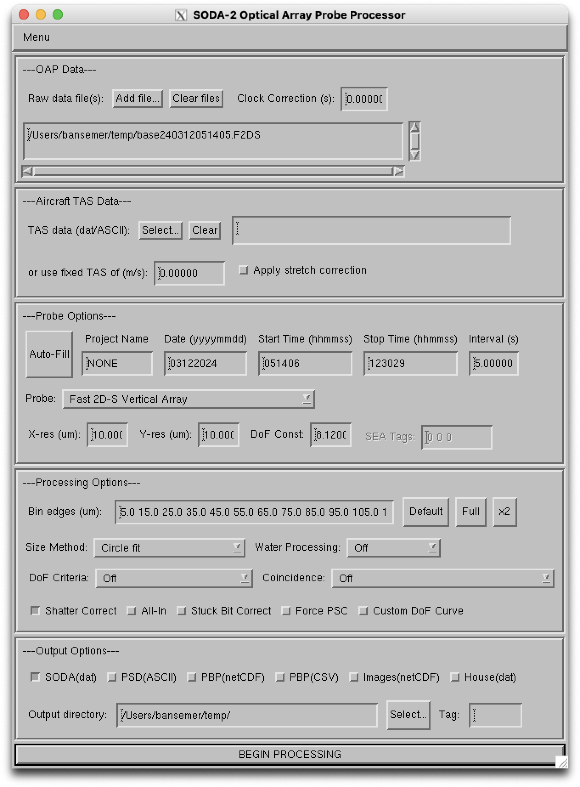
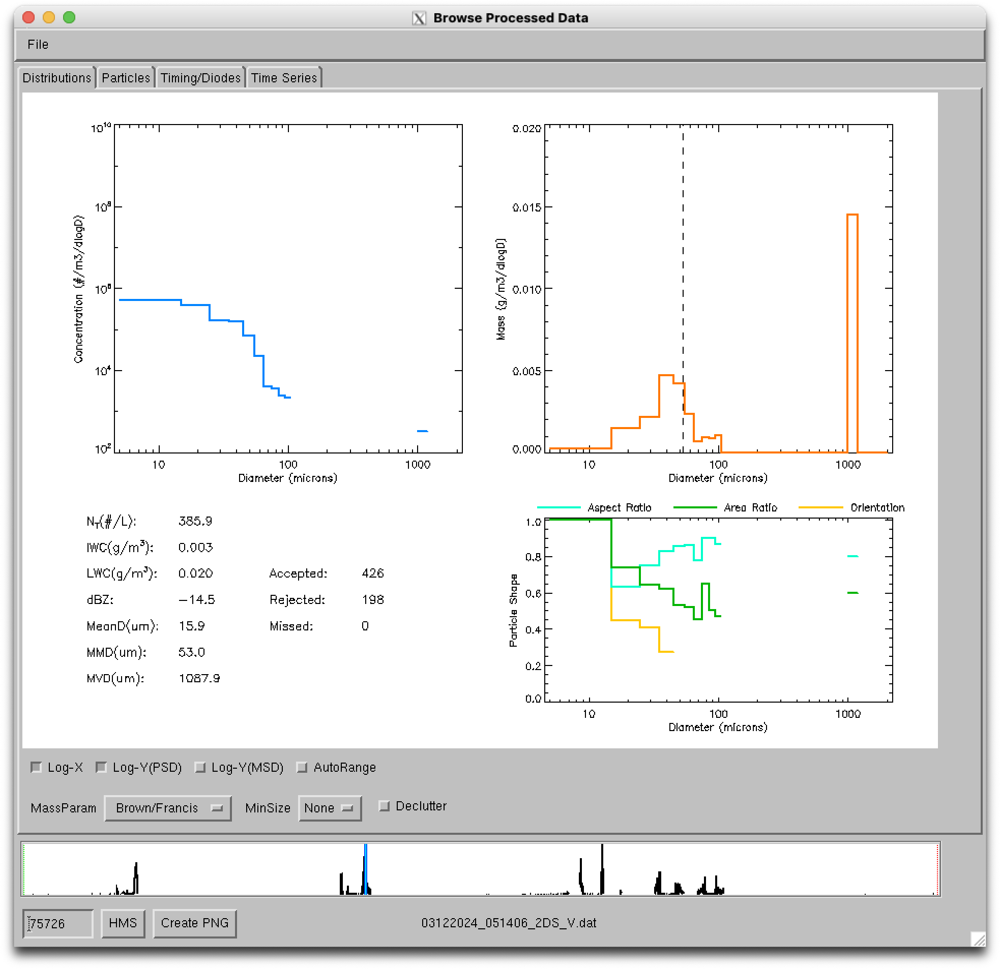

# SODA-2 Optical Array Probe Processor
### NCAR/MMM

***

## Introduction
The System for OAP Data Analysis (SODA) is a software package designed to process and analyze raw image data from
Optical Array Probes (OAPs).  The version described here, SODA-2, is for use with modern probes such as those
manufactured by Droplet Measurement Technologies (DMT), Stratton Park Engineering Company (SPEC), Science Engineering
Associates (SEA), or probes using custom hardware interfaces such as the NSF NCAR Fast-2DC.  SODA-2 supports a variety
of data formats, including the native raw data formats from DMT, SPEC, SEA M-200/300, and NCAR/RAF.  Older probes,
such as the PMS 2D-C and 2D-P, are also supported but should be processed and verified with the original SODA-1 package
which can account for the more complicated buffer timing used with those instruments.

During initial processing SODA-2 creates particle distributions binned by size, area ratio, and aspect ratio, makes
corrections for shattering and out-of-focus particles, organizes housekeeping data, and creates image links to locations
within the raw data files.  All of this data is saved in a new file which can be used for further analysis. After
processing, SODA-2 can be used to evaluate probe performance, compute cloud/precipitation parameters, and export data
to image sequences or to netCDF files.  This manual describes the installation, features, and processing details for
SODA-2.  For more information, please contact the developers or see slide presentation available at
[this link](https://docs.google.com/presentation/d/1hnSNpKHqdgVn2yw3VFIJwstqrDNJqUf_w8MM2R25LFw/edit?usp=sharing).

## Installation
SODA-2 requires the Interactive Data Language (IDL) software package, either as a full IDL distribution or the freely
available IDL Virtual Machine.  

### Using a full IDL distribution
1.	Download the latest version of the code from the SODA-2 repository
   *	**Git:** `git clone https://github.com/abansemer/soda2`
   *	**Direct download:** Go to <https://github.com/abansemer/soda2>, click on the green `Code` button, download the zip file, and unzip into
   a directory on your local machine.
2.	Add the code location to the IDL search path using one of the following options
   * **IDL Desktop Environment:** Add the SODA-2 directory location under *IDL/Settings/IDL/Paths/Insert*.
   * **IDL command line:** Modify the *!path* system variable to include the SODA-2 directory location `IDL> !path = !path + ‘:/my_programs/soda2’`. This command can be run automatically by adding it to the IDL startup script.
4.	Type `soda2` at the IDL command prompt to start the processing software.

### Using the IDL Virtual Machine
1.	Install the virtual machine, which is freely available as part of the trial IDL installation at
<https://www.nv5geospatialsoftware.com/>
2. Download the compiled version of SODA-2
[here](https://drive.google.com/file/d/13mlf-uNGj3WTu-8RpKG6KbBnVXKpCL8w/view?usp=drive_link).
3. Double-click on the *soda2.sav* icon.

## Data Processing
Type `soda2` at the IDL command prompt to start the processing software, or choose the file *soda2.sav* when prompted by
the IDL Virtual Machine.  The data processing window appears when the software is started.

To begin processing data:

### 1.	Select raw data files
In the Raw Data section, click on `Add file...` and select the raw OAP files to be processed. These files are usually
named *baseYYMMDDhhmmss.2DS* (SPEC instruments), *Imagefile_01CIP.raw* (DMT instruments), or *YYYY-MM-DD-hhmm.sea*
(SEA).  Multiple files can be selected using the `Shift` or `Ctrl` keys. If the raw data need a time correction, enter
the offset time in seconds in the `Clock Correction` box.

### 2.	Enter True Air Speed (TAS)  
Enter the source of true air speed for the flight in the `TAS data` box, which is recommended for computing an accurate
estimate of the probe’s sample volume. Two file formats are supported:  
   1. An ASCII file with time (UTC seconds) in the first column and TAS (meters/second) in the second column.  Space,
   tab, or comma delimiters are accepted.
   2. An IDL .sav file, which should have a single structure named *data* containing the variables *time* (in UTC
   seconds) and *tas* (in meters/second).  The *time* and *tas* records in this file should match what will be
   entered into the probe options start/stop time fields.   

Enter a fixed TAS or if no other source is available.  The default air speed is 100 m/s.

Select the `Apply stretch correction` option if the aircraft TAS and the probe slicing TAS were unsynchronized, leading to
stretched or compressed particles in the airflow direction.

### 3.	Select probe options
1.	Click `Auto-Fill` to check the selected raw data files and automatically fill in the date and start/stop
times.  This also removes incompatible probes from the dropdown list.
2.	`Project name`  Enter a project name identifier to be saved with the data.  
3.	`Date`  Enter the flight date in format YYYYMMDD or MMDDYYYY, if not entered correctly by Auto-Fill.
4. `Start/Stop time`  Enter the time interval to process from the raw data in HHMMSS format.  A shorter time interval
will save memory and disk space and reduce processing time.
5. `Rate`  Enter an averaging interval for the time series data.  Intervals shorter than one second are possible but
will require more memory to store the particle distributions.
6. `Probe`  Select the probe from the dropdown list. New probes can be added to the list in *soda2_probespecs.pro*.  
7. Make any necessary adjustments to the `X-resolution`, `Y-resolution`, or `Depth-of-Field constant` based on laboratory
calibrations.  The SEA tag numbers can also be adjusted here if they do not match the original configuration.

### 4.	Select processing options
1.	Adjust the size `Bin edges` values as needed.
   * The `Default` button will load a recommended bin distribution based on the currently selected probe resolution.  
   * The `Full` button will load a linear distribution of bins centered on the current X-resolution value, one bin for
   each element in the diode array.  
   * The `x2` button copies the `Full` button, but with twice the number of bins to cover particle sizes up to twice the array width.

2.	Select the `Particle sizing method` to be used for constructing the particle size distributions.
   * `Circle fit (Default)` The diameter of the smallest circle that completely encloses a particle.
   * `X-Size`  The maximum distance between shadowed pixels across the array.
   * `Y-Size`  The maximum distance between shadowed pixels along the airflow direction.
   * `Area equivalent`  The diameter of a circle that has the same area as the imaged particle.
   * `Lx` The maximum distance between two shadowed pixels on a single slice in the particle image.
   * `1D emulation` The total number of diodes occluded during particle transit.
   * `2D emulation` The maximum number of diodes occluded on a single slice during particle transit.

3. Enable `Water Processing` criteria if needed.  This option is intended to improve rejection criteria
   when measuring clouds composed primarily of liquid (non-ice) hydrometeors.
   * `Off (default)` Do not apply any extra rejection criteria for round particles.
   * `Standard` Reject particles with area ratio below 0.5.  This also applies the Korolev (2007) correction for
   out-of-focus particles.
   * `Strict` Reject particles with area ratio below 0.7.  This also applies the Korolev (2007) correction for
   out-of-focus particles.

4. Enable `Depth of Field` (DoF) rejection criteria.  This option applies various algorithms to detect and reject
out-of-focus particles.
   * `Off (default)`  Do no apply any extra DoF rejection criteria.
   * `One Level-3 Pixel`  Require at least one pixel to have the darkest available shadow level.  This applies only
   to probes that record 3-level grayscale images or track the number of dark pixels.
   * `50% Level-3  Pixel Ratio`  Require that half of the pixels in a paricle have the darkest available shadow
   level.  This applies only to probes that record 3-level grayscale images or track the number of dark pixels.
   * `Particle Compactness`  Require that small particles are relatively compact, without a significant number of
   stray or unconnected pixels.  This is the only option that works with probes that record pixels at a single 50%
   shadow level.

5. Enable `Coincidence` corrections to handle stray pixels and multiple particles within the same image frame.
   * `Off (default)` Do not apply any coincidence corrections.  All pixels in a frame are assumed to be from a single
   cloud particle.
   * `Largest particle (Default)` Discard any shadowed pixels that are not connected to the largest connected blob,
   after a 2-pixel dilation.
   * `Largest particle (Small dilation)` As above, but using a 1-pixel dilation.
   * `Largest particle (No dilation)` As above, but without any dilation.  

6.	Check box to apply a `Shattering Correction` based on particle interarrival times.  The method is described
in Field et al. (JTECH, 2006).

7. Check box to apply `All-in`, where particles that touch either edge of the array are rejected.

8. Check box to apply a `Stuck bit` correction caused by optical or electronic malfunctions.  Diodes that have an
unusually high or low shadow count will be replaced by a neighboring diode.

9. Check box to force the Korolev (2007) `Poisson spot correction` (PSC) for all particles, even in non-round images.

10. Check box to enter a `Custom depth-of-field` curve.  A separate dialog will open after clicking the `BEGIN
PROCESSING` button where the curve can be defined.

### 5. Select output options
1. Check `SODA(dat)` box to save the processed data in an IDL-formatted *.sav* file. This file records all processing
options, processed data, and housekeeping data, and is required to view data with the IDL browser or to export to other
data formats.  See the file format section of this document for detailed information about this file.

2. Check `PSD(ASCII)` box to save the processed particle size distributions (PSDs) to an ASCII file.

3. Check the `PBP(netCDF)` box to save particle-by-particle (PBP) data to a netCDF file.  All particle timing and
size measurements are included in this file.

4. Check the `PBP(CSV)` box to save particle-by-particle (PBP) data to a comma separated value ASCII file.  This file
may be very large so a short time window defined by the start/stop time fields is recommended.

5. Check the `Images(netCDF)` box to save both the PBP data and the particle images to a netCDF file.

6. Check the `House(dat)` box to save the housekeeping data to an IDL *.sav* file for quick dat quality checks.

7. `Output directory`  The directory where all output files will be written.

8. Enter an optional `Tag` to add an identifier to the filename(s) that will be written.

### 6. Click `BEGIN PROCESSING` to process the data.  

Processing will take several minutes to hours depending on the amount of data.  Once completed, new files containing the
processed data will be saved with the following naming conventions:

    date_starttime_probetype_tag.dat
    date_starttime_probetype_tag.txt
    date_starttime_probetype_tag.pbp.csv
    date_starttime_probetype_tag.pbp.nc  

## Data Reprocessing
Settings from a previously processed *.dat* file can be reloaded under the *File/Load* Settings menu option.  Any of the
processing options can then be changed before reprocessing.  The old file will be overwritten unless a new output
directory is selected or a new tag is used.

Alternately, the IDL files can be reprocessed via command-line or script.  Modifications are directly applied to the
options structure (see file format information at the end of this document) and then reprocessed.  For example:

    IDL> restore, ‘myfile.dat’
    IDL> data.op.rate = 1               ;Change the sampling rate
    IDL> soda2_process_2d, data.op      ;Reprocess the data

## Browsing Processed Data
Select *Menu/Browse Data* from the main SODA-2 window to load the data browser.  The browser may also be accessed directly from IDL command line by typing `soda2_browse`.  Load a processed (*.dat*) file under the *File/Load* menu to begin browsing.

### Navigating through the data:
The first 3 tabs (*Distributions*, *Particles*, and *Timing/Diodes*) display data for a single time period.  To move
forward in time, left-click anywhere on the main plot.  To move backward in time, right-click on the main plot.  The
scroll wheel on a mouse may also be used to move forward or backward.  A blue indicator line shows the
current position in the concentration plot at the bottom of the screen.  Left-click on this plot to directly access
a new time period.  A new time may also be typed into the text box at the bottom-left corner of the window in either
'hhmmss' or seconds-from-midnight format.  Click the `HMS` or `SFM` button to toggle formats.

1. **Distributions tab:**
The default tab shows the normalized particle size distribution, the mass-size distribution, and shape distributions
of area ratio, aspect ratio, and particle orientation.  Computed bulk values such as total number concentration, ice
water content, and mean diameter for the current time period are displayed.  The mass-size parameterizations and
minimum size used in the computations can be adjusted in the menus at the bottom of the screen.

2. **Particles tab:**
This tab displays the images of the particles recorded for each time period.  The original raw data files must be
available in order to view this screen since the images are not saved in the processed file.  Only images that fit on
the screen are displayed.  To see more images click on the arrow buttons below the displayed images.  The boundaries
between particle frames can be displayed with the `Show Dividers` checkbox.

3. **Timing/Diodes tab:**
This tab shows the interarrival time and diode histograms.  Ideally, the interarrival time plot (top panel) should have
a shape resembling a Poisson distribution.  The diode histogram (bottom panel) shows the total number of shadows
recorded during each time period.  If sufficient particles were recorded, then the histogram should be a relatively flat
line.  The distributions of interarrival time and diode histograms for the entire flight are also displayed by the red
dashed line.

4. **Time series tab:**
This window displays time series plots of derived parameters and housekeeping data.  Two plotting windows are available,
and the value to be plotted on each is changed with the drop-down menus.  The start and end times can be adjusted with
the mouse by click-dragging a box on either the data plots or the reference plot at the bottom of the screen.  The green
 and red indicators on the reference plot show the current range.  

**Saving plots:**
Click the `Create PNG` button on any screen to save the current plot(s) to a PNG image.  It will be saved in the
directory where the processed file is located.

## Exporting Data
The processed data and images can be exported to netCDF or ASCII-CSV (size distributions) and PNG (images) for
compatibility with Matlab, Python, or other software packages.  Select *Menu/Export Data* from the main SODA-2 window to
 open the data export menu.  Add processed *.dat* files to the list for export.  

NetCDF files will contain particle size distributions, counts, interarrival time distributions, and a variety of
derived bulk parameters such as IWC, mean diameter, and total area.   See the program *soda2_export_ncdf.pro* for more
options.

PNG files each contain one minute of  sample images, with one image buffer (roughly 1000 slices) shown for each time
interval that was processed.  Use the command-line version to output all images or to specify start and/or stop times,
for example:

 	IDL> soda2_imagedump, ‘myfile.dat’, /all, starttime=hms2sfm(130000)

## Processing Details
### Particle Sizing and Sample Area
Particles can be measured by several methods, including circle-fit, sizing across the array (x-size), sizing with the
airflow (y-size), area equivalent sizing, and slice-width sizing (Lx).  

The circle-fit method is the default sizing method.  It fits the smallest possible circle around a particle image and
uses the diameter of that circle as the diameter of the particle.  This method is used for its computational efficiency,
as well as its ability to produce a reliable comparison of the area of particle to the area of the circle.  This “area
ratio” is used for subsequent particle rejection, roundness detection, and may also be used for computing such
parameters as fall velocity and optical extinction.

The x-size and y-size methods measure the maximum distance between shaded pixels in their respective directions.   
X-size may be useful for spinning disc calibrations, or for any time where the probe's timing did not match the particle
speed resulting in stretched or compress images in the airflow direction.  Similarly, Lx sizing defines particle size by
the maximum distance between shaded pixels on any individual slice of a particle (but not of the entire particle).  This
is used for situations where particles have a skewed appearance from transiting through the laser in an off-axis
direction.

Area equivalent sizing defines particle size as the diameter of a circle which would have the same shadowed area as the
particle image.  1D and 2D Emulation sizes replicate legacy instrument sizing methods such as those used by the 260X and 260Y.  

Under ‘water’ processing a sizing correction is applied following Korolev (JTECH, 2007).  This correction is based on the size
of the Poisson spot seen when imaging liquid particles, and indicates magnification of a particle due to its position in
the depth of field.  If a Poisson spot is detected its area is measured and compared to the area of the complete
particle.  The ratio of these two areas is used to find a correction factor, which reduces the size measurement to its
expected pre-magnification value.  

In all sizing methods, partially imaged particles which touch either or both ends of the diode array are allowed by
default if the center of the particle is deemed to be within the array.   The sample area of the probe is computed
following the center-in method described in Heymsfield and Parrish (1978).  If the user elects to reject partially
imaged particles (All-in option), the sample area is computed following Equation 4 of the same reference.  

### Shattering Corrections
Large particles that impact on the forward surface of a probe arm can break into many pieces and then be imaged by the
probe.  This results in an overestimate of the concentration of small particles.   Since these small particles appear in
clusters, the time between neighboring particles, or interarrival time, may be used to detect suspected shattering
events.  SODA-2 corrects for shattering events using the method described in Field, et al. (2006).  This method requires
at least 100 particles per time period, so it is recommended to use a sufficiently long averaging time (in the `Rate` box
on the SODA-2 main screen) to ensure that enough particles are available to activate the correction.

### Particle Rejection Criteria
The particle rejection criteria in SODA-2 serve two purposes, to distinguish between “round” and “irregular” particles
if water processing is enabled, and to remove image artifacts.  Image artifact rejection is based on the area ratio.
The rejection criteria details are as follows:

#### Default Processing
- Area ratio < 0.1
- Particle size is outside of size-bin range
- Depth of field criteria not met (if enabled by user with *DoF_reject* setting)
- Particle center is deemed to be outside the array
- Particle touches an edge of the array (if enabled by user with *all-in* setting)

#### Water processing
- Area ratio < 0.4
- Area ratio < 0.5 for particles 10 pixels or larger (0.7 for strict water processing)
- Size > 6mm
- Corrected particle size is outside of size-bin range
- Depth of field criteria not met (if enabled by user with *DoF_reject* setting)
- Particle center is deemed to be outside the array
- Particle touches an edge of the array (if enabled by user with *all-in* setting)

## Processed data file format
Processed data is saved in a raw data file using IDL's proprietary save/restore format.  This file can be used
directly for analysis beyond the capabilities of the SODA-2 data browser.

    IDL> restore, 'myfile.dat'
    IDL> help, data

Libraries are available for reading these files directly into Python (scipy.io.readsav) and Matlab.  Once loaded,
all data will be available in a structure named *data*.  The structure has a number of tags with processed
information, and a sub-structure named *data.op* containing processing options.

| Variable             | Description |
| --------             | ----------- |
| op                   | A sub-structure containing the processing options in the table below |
| time                 | Time in seconds from midnight UTC on the date specified in 'DATE' |
| tas                  | True air speed used in concentration computation |
| probetas             | True air speed used by the probe for slicing rate |
| midbins              | Size bin mid-points |
| activetime           | Probe activity time (seconds) |
| date_processed       | Date and time of processing |
| sa                   | Sample area of each size bin (m2) |
| intspec_all          | Counts per interarrival bin in a [time, interarrival bin] array for all (accepted+rejected) particles |
| intspec_accepted     | Counts per interarrival bin in a [time, interarrival bin] array for accepted particles |
| intendbins           | Interarrival bin end-points (seconds) |
| intmidbins           | Interarrival bin mid-points (seconds) |
| count_rejected       | The number of particles rejected in a [time, reason] array. 0:Unused, 1: Area ratio too low, 2: Interarrival time below threshold, 3: Particle size out of size bin range, 4: Particle touches edge of array, 5: ‘Water’ criteria not met, 6: ‘Ice’ criteria not met, 7: Depth of field flag rejection |
| total_count_rejected | Total number of rejected particles |
| count_accepted       | The number of particles accepted |
| count_missed         | The number of particles that were not recorded |
| missed_hist          | Histogram of the number of missed particles for each time period |
| conc1d               | Normalized particle concentration in a [time, size bin] array (#/m3/m) |
| spec1d               | Counts per size bin in a [time, size bin] array |
| spec2d               | Counts per bin in a [time, size bin, area ratio bin] array |
| spec2d_aspr          | Counts per bin in a [time, size bin, aspect ratio bin] array |
| corr_fac             | Correction factor for interarrival time correction |
| poisson_fac          | Coefficients for the double-Poission interarrival time fit |
| intcutoff            | Interarrival time threshold for accepted/rejected particles |
| pointer              | Pointer to each buffer in the raw data files |
| ind                  | Time index into which each buffer starts |
| currentfile          | File number for each buffer/pointer |
| numbuffsaccepted     | Number of accepted buffers |
| numbuffsrejected     | Number of rejected buffers |
| dhist                | Detector shadow counts in a [time, n_diodes] array |
| hist3d               | Experimental |
| spec2d_orientation   | Particle orientation counts in a [time, size bin, orientation bin] array.  Orientation bins are 10-degrees each  |
| orientation_index    | Orientation index in a [time, size bin] array |
| house                | A substructure containing housekeeping data, when available |
| pbpstartindex        | The index of the first particle in the particle-by-particle files for each time period |

| Processing Option      | Description |
| --------               | ----------- |
| op.fn                  | The original filenames entered into the GUI |
| op.date                | Date string entered into the GUI |
| op.starttime           | Start time (UTC seconds) |
| op.stoptime            | Stop time (UTC seconds) |
| op.format              | Data acquisition format |
| op.subformat           | Data acquisition sub-format |
| op.probetype           | Probe type (2DC, 2DP, etc.) |
| op.res                 | Probe resolution across the array (microns) |
| op.yres                | Probe resolution in the airflow direction (microns) |
| op.dofconst            | Depth of field constant for computing sample area |
| op.endbins             | Size bin endpoints (microns) |
| op.arendbins           | Area ratio bin endpoints (unitless) |
| op.rate                | Averaging interval (seconds) |
| op.smethod             | Particle sizing method used (‘fastcircle’, ‘xsize’, etc.) |
| op.pth                 | IDL .sav file or ASCII file which contains true air speed data |
| op.asciipsdfile        | Flag for creating an ASCII particle size distribution file |
| op.savfile             | Flag for creating a .sav file |
| op.inttime_reject      | Flag for applying interarrival time rejection |
| op.eawmethod           | Equivalent array width method (‘centerin’, ‘allin’) |
| op.stuckbits           | Flag to turn on stuck bit detection and correction |
| op.water               | Flag to use ‘water’ processing algorithm |
| op.fixedtas            | Fixed air speed to use if pthfile is unavailable |
| op.outdir              | Output directory |
| op.filetag             | User-selected file identifier |
| op.project             | Project name entered in GUI |
| op.timeoffset          | Filenames that pass data integrity test |
| op.armwidth            | Distance between probe arms (cm) |
| op.numdiodes           | Number of diodes in the image array |
| op.probeid             | Probe ID for raw files that contain multiple probes |
| op.shortname           | Probe name used when constructing filenames |
| op.greythresh          | Threshold on which to size particles for grayscale probes |
| op.wavelength          | Laser wavelength (m) |
| op.seatag              | Tags for reading from SEA files [image_tag, tas_tag, elapsedtime_tag] |
| op.ncdfparticlefile    | Flag for creating a netCDF particle-by-particle file |
| op.particlefile        | Flag for creating an ASCII particle-by-particle file |
| op.stretchcorrect      | Enable stretch correction when there is a mismatch between the aircraft TAS and the probe slicing TAS |
| op.keeplargest         | Only measure the largest particle in a frame |
| op.apply_psc           | Flag to apply Korolev (2007) size correction on all particles |
| op.apply_psc_sizelimit | Maximum size in microns to apply the size correction |
| op.dofreject           | Flag for rejecting particles for instruments that record a depth of field flag (or grayscale instruments) |
| op.dioderange          | Lower and upper index of active diodes, for cropping inactive diodes from the array edges |
| op.customdof           | Custom depth of field values |
| op.clusterthresh       | Flag to enable a cluster-based shattering algorithm (experimental) |
| op.rakefix             | Enable correction for particle raking |
| op.juelichfilter       | Remove speckle noise on CIP-Gray probes |
| op.ignoredeadtime      | Process without considering probe overload time |
| op.strictcounter       | For CIP-Gray only, enable strict particle rejection when the particle counter goes awry |
| op.activetimemissed    | Flag to compute active time from the number of missed particles (experimental) |

## Particle-by-particle data file format
Particle-by-particle files can be read with the included netCDF utility which loads the variables into a structure
named *data*:

    IDL> restorenc, 'myfile.pbp.nc'
    IDL> help, data

Variable descriptions are available in the *attributes* sub-structure, with any netCDF browser, or with the command
line *ncdump* utility.

| Variable        | Description |
| --------        | ----------- |
| TIME            | UTC time [seconds] |
| PROBETIME       | Unadjusted probe particle time [seconds] |
| BUFFERTIME      | Buffer time [seconds] |
| RAWTIME         | Raw time [slices or seconds] |
| REFTIME         | Reference time for buffer matching [secnds] |
| INTTIME         | Interarrival time from previous particle [seconds] |
| DIAM            | Particle diameter from circle fit. No Poisson spot size corrections applied [microns] |
| XSIZE           | X-size (across array). No Poisson spot size corrections applied [microns] |
| YSIZE           | Y-size (along airflow). No Poisson spot size corrections applied [microns] |
| XEXTENT         | Maximum x-extent (across array) for all individual slices. No Poisson spot size corrections applied [microns] |
| ONED            | 1-D emulation size. Number of latched pixels. No Poisson spot size corrections applied [microns] |
| TWOD            | 2-D emulation size. Slice with maximum number of shaded pixels. No Poisson spot size corrections applied [microns] |
| AREASIZE        | Equivalent area size. No Poisson spot size corrections applied [microns] |
| AREARATIO       | Area ratio [unitless] |
| AREARATIOFILLED | Area ratio with particle voids filled [unitless] |
| ASPECTRATIO     | Aspect ratio [unitless] |
| AREA            | Number of shaded pixels [pixels] |
| AREAFILLED      | Number of shaded pixels including voids [pixels] |
| PERIMETERAREA   | Number of shaded pixels on particle perimeter [pixels] |
| AREA75          | Number of shaded pixels at the 75% (or grey level-3) shading [pixels] |
| XPOS            | X-position of particle center (across array) [pixels] |
| YPOS            | Y-position of particle center (along airflow) [pixels] |
| ALLIN           | All-in flag (1=all-in) [unitless] |
| CENTERIN        | Center-in flag (1=center-in) [unitless] |
| DOFFLAG         | Depth of field flag from probe (1=accepted) [unitless] |
| EDGETOUCH       | Edge touch (1=left 2=right 3=both) [unitless] |
| SIZECORRECTION  | Size correction factor from Korolev 2007 (D_edge/D0). Use to adjust sizes in this file if necessary [unitless] |
| ZD              | Z position from Korolev correction [microns] |
| MISSED          | Missed particle count [number] |
| PROBETAS        | True air speed for probe clock [m/s] |
| AIRCRAFTTAS     | True air speed for aircraft (if available) [m/s] |
| OVERLOADFLAG    | Overload flag [boolean] |
| PARTICLECOUNTER | Particle counter [number] |
| ORIENTATION     | Particle orientation relative to array axis [degrees] |
| REJECTIONFLAG   | Particle rejection code, reported as the sum of all reason codes (see soda2_reject.pro) [unitless] |
| NUMREGIONS      | Number of connected regions (blobs) in the particle image, if the KEEP_LARGEST option is enabled |
| DIODEGAPS       | Number of unshaded diodes between the first and last shaded diodes |
| ATTRIBUTES      | A sub-structure containing all variable attributes |
| GLOBAL          | A sub-structure containing all global attributes |
